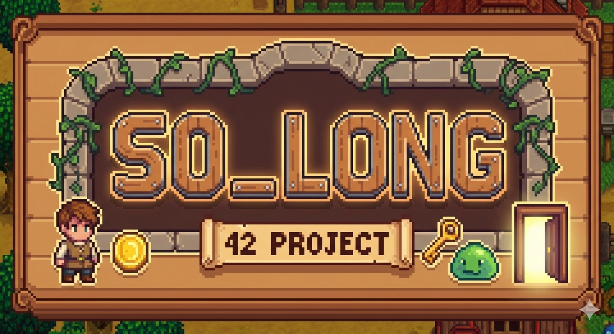

<!-- *********************************************************************** -->
<!--                                                                         -->
<!--                                                      :::      ::::::::  -->
<!-- README.md                                          :+:      :+:    :+:  -->
<!--                                                  +:+ +:+         +:+    -->
<!-- By: rpinheir <rpinhier@student.42Lausanne.ch>  +#+  +:+       +#+       -->
<!--                                              +#+#+#+#+#+   +#+          -->
<!-- Created: 2026/01/08 18:22:25 by rpinheir          #+#    #+#            -->
<!-- Updated: 2026/01/08 19:41:12 by rpinheir         ###   ########.ch      -->
<!--                                                                         -->
<!-- *********************************************************************** -->

###### *This project has been created as part of the 42 curriculum by rpinheir*

# SO_LONG
## Description
This project is all about learning to do visual programs using a lib for x-windows on linux. More specifically, i must build a game made from C using minilibX, it must have an exit, one player, one consumable/item. And most importantly a parser of maps, and make sure they are valid following all requirements (flood fill algorithm per example), and also be possible to close with escape key and also red button from window decorations.

## Introduction
How to launch the project:

```bash
make
```
```
./so_long map.ber
```

## Ressources
Using currently [This website](https://harm-smits.github.io/42docs/libs/minilibx) for documentation purposes, this is a good start but it lacks info on specific cases like in so_long where we dont need to display lines and pixels manually (like it could be with FdF), as in so_long i must work with .xpm sprites (images used as 2d textures for a game).
